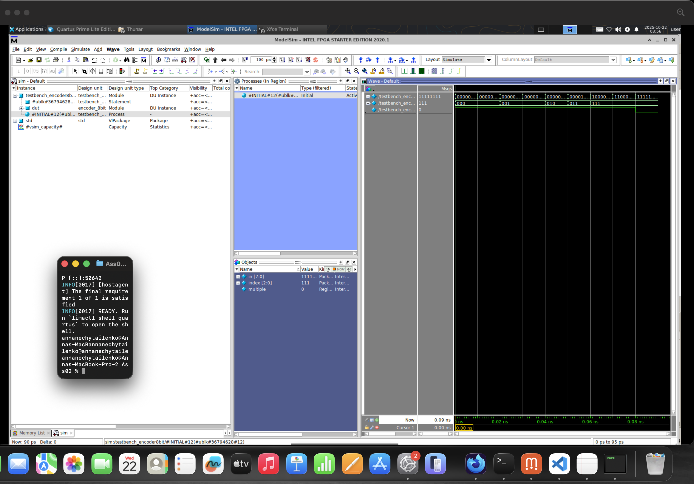
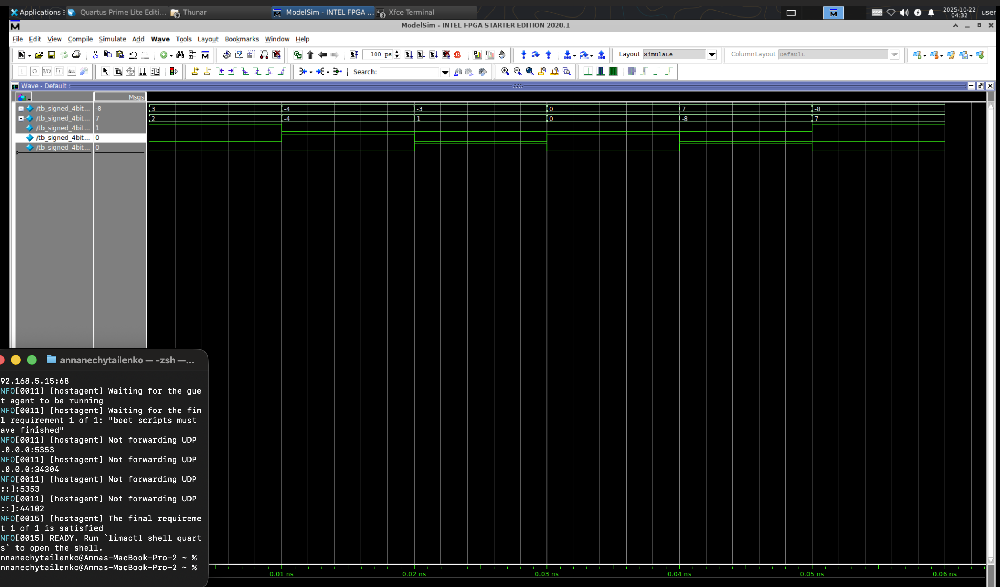
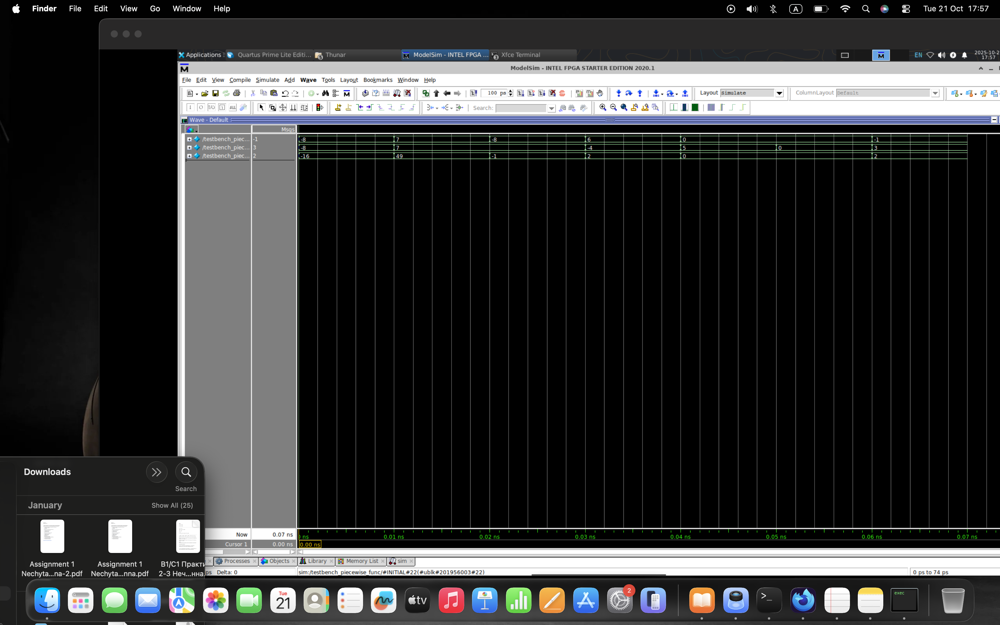
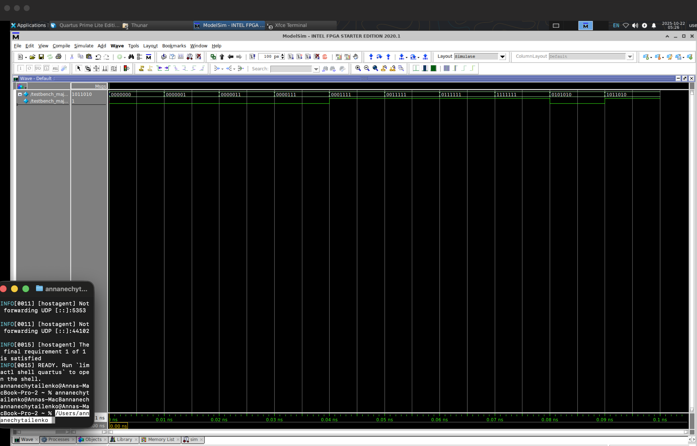
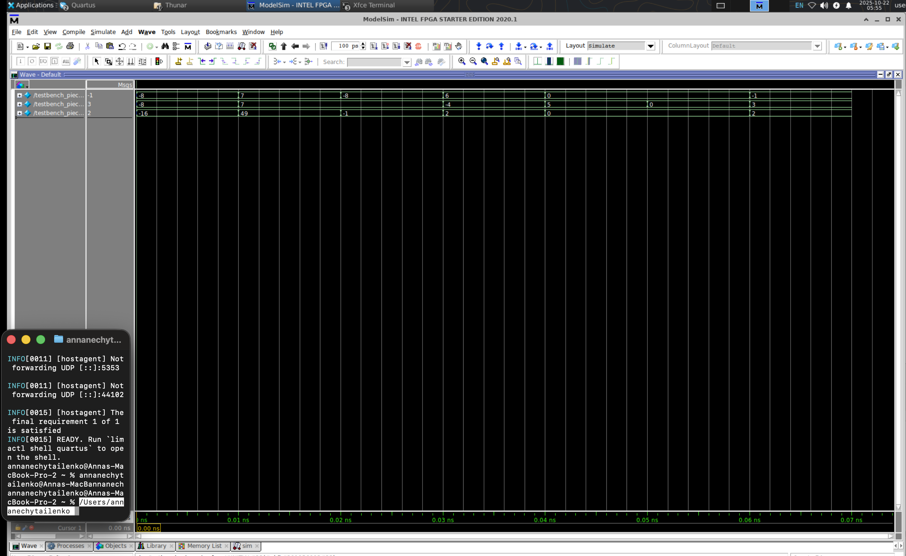

## Task01:

Implement a priority encoder which displays an index (starting from 0) of the most significant bit which has value of 1 with such settings: 8-bit input and 3-bit output, one separate output signal to show if we have more than one bit which has a value of 1.

Solution: [file](Task01/encoder_8bit.sv)

1) Var to indicate if there is more then one 1:  Use accumulator to get the amount of 1s in input siganl, then compare with constant value 1(by performing subtraction and get MSB)
2) 3-bit output index value: usage of casez

## Task02:

Implement a comparator which compares two numbers : two signed 4-bit numbers

Solution: [file](Task02/signed_4bit_comparator.sv)

1) Output 3 signals to indicate < , > , == : leverage 1 bit full adder and analyze MSB

## Task03:

Implement a multiplexer: which has 12 2-bit inputs and one 2-bit output. In case a signal which has 4 bits receives a value bigger than 11 it should set output as 2’b11.

Solution: [file](Task03/mux_12_2bit.sv)

1) Output 2-bit signal : build mux as the case statement and default to handle value greater 11

## Task04:

Implement a majority function module (output 1 if ≥50% inputs are high):7-input majority (output 1 if ≥4 are high).

Solution: [file](Task04/majority7.sv)

1) Output 1-bit signal toindicate majority of 1s : leverage accumulator to get sum of all 1s in the inpur signal and then compare with threshold( constant 4) by subracting and analyzing MSB. Although, here accumulator and subtraction both leverage adder that operate on 3 bit numbers, I thought it would be greate to practice  knowledge about parametr modules.

## Task05:

Implement a module which is a piecewise combinational function: If one of the two signed 4-bit inputs is negative - then output equals sum of the inputs. Otherwise it equals input1*input2

Solution: [file](Task05/piecewise_func.sv)

1) output 7-bit signal :usage of multiplier to decide what to select : sum or product. Sum was implemented in the similar way as adder in previos task, howerver here was used hierarchy: 8 bit adder consist of 4 bit adder. The product was created using concept n << k = n * 2^k and adder. 

