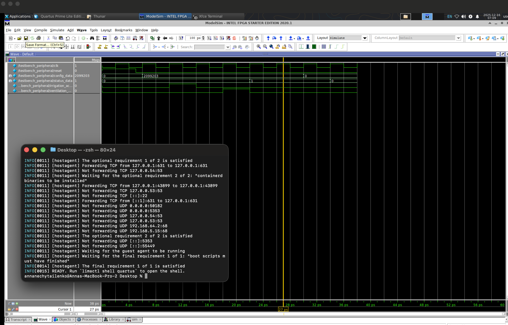
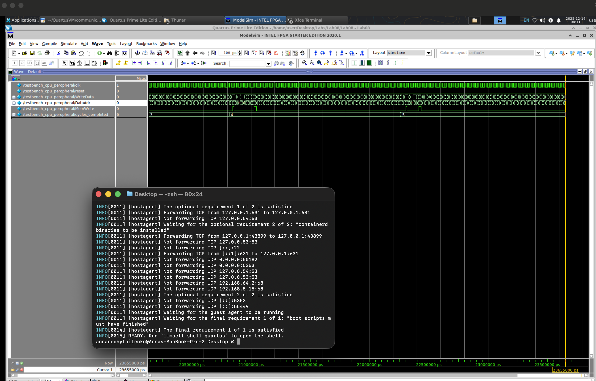
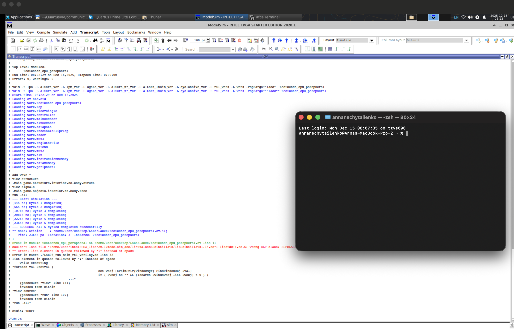
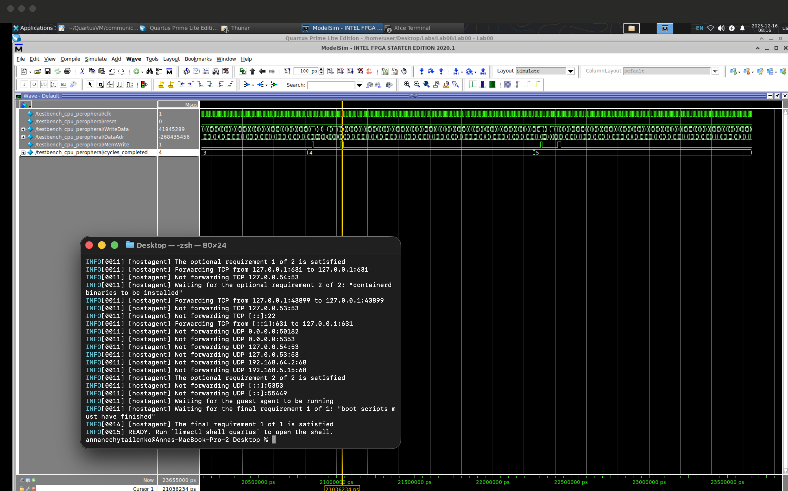
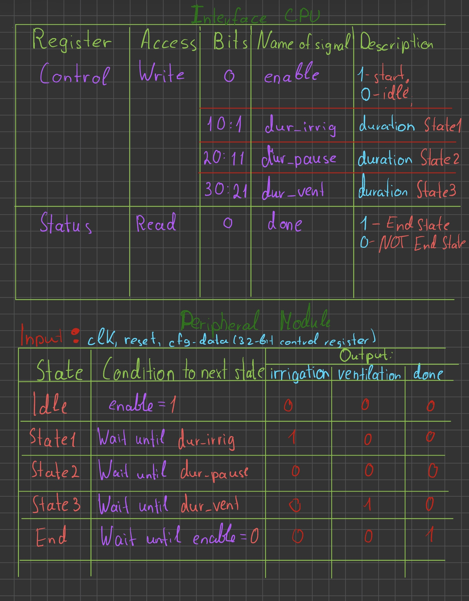

# Final Project Submission
# Option 2
# Nechytailenko Anna

Goal: Implement the peripheral simulation module and connect it to the single-cycle CPU from Assignment 7.

My first step was to impplement peripheral midule that constitute as the FSM. So it was sequential circuit that is Moore machine, and depends on the current state only. The FSM has 4 states: IDLE, STATE1, STATE2, STATE3 and DONE - according to the project description.

Then i write the program in assembly where i define 3 configs that run 2 times each. The program writes the configs to the peripheral module and waits for the DONE signal after each config is sent. (Comments in the assembly code explain each step of the program).

Next step was to connect the peripheral module to the custom single-cycle CPU. After writing the program new command was not detected, so only change i made was in  [dataMemory](HDL_code/dmen.sv) to ensure the transfer of the control value from the control register(which in fact just determined cell) to the peripheral module, and the return transfer of the cycle-completion signal to the status register (which is also just determined cell) , as well as coordinate the enable signal and duration of each stage in the FSM. Also changes were made to the (top.sv)[HDL_code/top.sv] to instantiate the peripheral module and connect it to the CPU.

Finally, I tested the entire system to ensure that the peripheral simulation module works correctly with the single-cycle CPU. I verified that the FSM transitions through its states as expected and that the CPU can interact with the peripheral module properly.

There are two test one for FSM as single unit and another that run the program on the CPU with peripheral module connected.

FSM test: show correct state transitions and DONE signal after config values are sent and return to IDLE.

CPU with peripheral module test: show correct nimber of cycles by count status register after each config is sent and DONE signal is set correctly.

Also can see that data config value in Write Data of the peripheral module is correct and corresponds to the last  config value sent from the program and cycle 5 and 6 are the same length as the config3 value is sent two times.

Here is the interface of the cpu for the peripheral module:

./script.sh

./bin_script.sh

Helpful cites: 
- https://luplab.gitlab.io/rvcodecjs/
- https://venus.cs61c.org/

