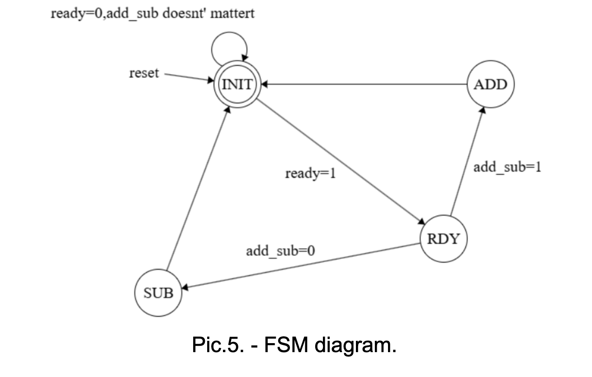
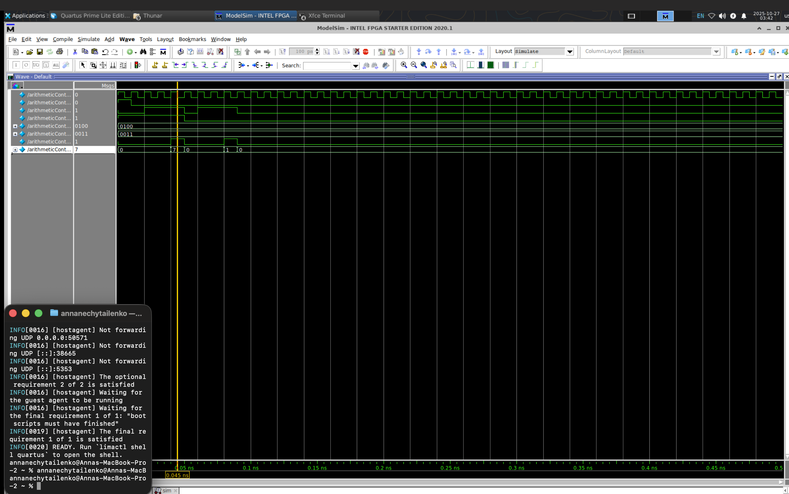

# Practice 5:  HDL Basics. Sequential Logic

## Objective:
create a simple sequential logic circuit using VHDL and simulate its behavior using SystemVerilog testbench.

## Step 1: Design the Sequential Logic Circuit

Have option2:  design specific FSM
Photo of FSM diagram:

1) Writing code using Moore machine model: divide by register, combinational logic for next state logic and output logic.

Sourse code: [arithmeticController.vhd](./arithmeticController.vhd)

2) Simulate the design using ModelSim. Test cases cover reset, add and sub functionality.

Testbench code: [arithmeticControllerTestbench.sv](./arithmeticControllerTestbench.sv)

3) Run simulation and capture waveforms for analysis.

Simulation Waveforms:

